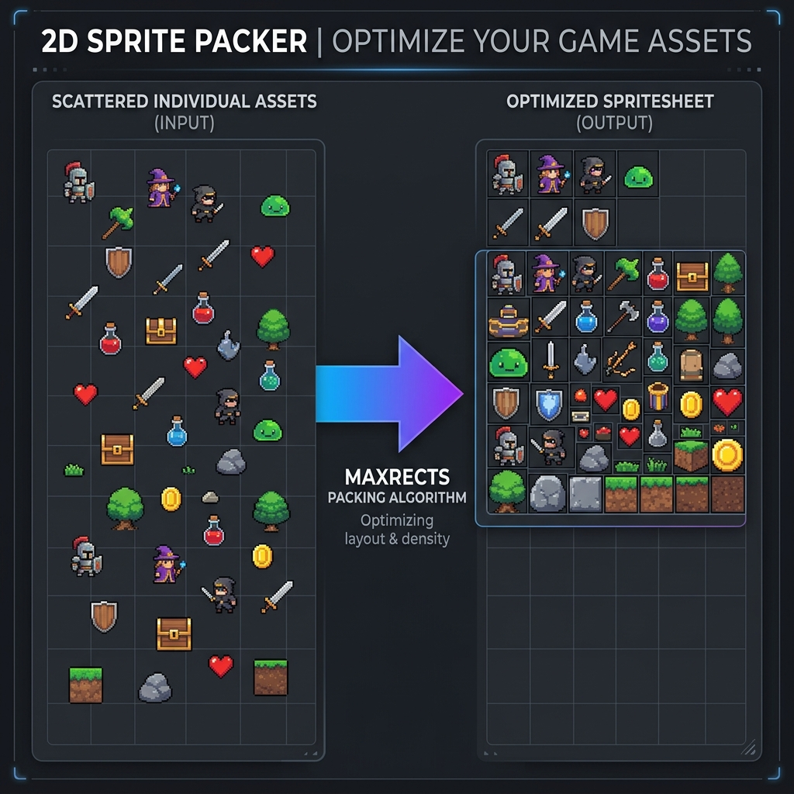

# Sprite Packer CLI 🎮



A professional command-line tool for Game Developers (especially tailored for MonoGame/XNA ecosystem) to pack scattered PNG frames into a single, highly optimized Sprite Sheet. 

It utilizes the advanced **MaxRects Bin-Packing Algorithm** to ensure zero wasted space and outputs a TexturePacker-compatible JSON format.

## ✨ Features

- **Advanced Bin-Packing:** Uses the industry-standard MaxRects algorithm (Best Short Side Fit) for maximum space optimization compared to basic shelf packing.
- **Auto-Grouping (`--auto-group`):** Automatically detects sprite prefixes (e.g., `hero_run_1.png` and `zombie_walk_1.png`) and groups them into separate sprite sheets (`spritesheet_hero_run.png`, `spritesheet_zombie_walk.png`) on the fly.
- **Smart Filtering (`--filter`):** Safely filter specific files using glob patterns (e.g., `--filter "zombie_*.png"`) with built-in case-sensitivity and OS-agnostic protection.
- **MonoGame Ready:** Directly exports TexturePacker JSON (Array format), easily readable by MonoGame.Extended or custom content pipelines.

## 🚀 Installation & Setup

You can either run this tool as a standalone executable (no installation required) or as a Python script.

### Option A: Standalone Executable (Windows)
1. Download the `sprite-packer-cli.exe` from the Releases tab (or find it in your `dist/` folder if you built it yourself).
2. Simply double-click the `.exe` file.
3. An interactive wizard will open in the terminal and ask you for the necessary paths and options!

### Option B: Run from Source
Ensure you have Python 3.x installed. Then install the required dependencies:

```bash
pip install -r requirements.txt
```

## 🖱️ Usage (Interactive / Normal Mode)

The easiest way to use the tool is through its built-in interactive wizard. You don't need to type any complex commands!

1. **Double-click** the `sprite-packer-cli.exe` file.
2. A terminal window will open and guide you step-by-step:
   - **Input Directory:** Where your scattered `.png` files are located. (Press Enter to use the default `./input` folder).
   - **Output Paths:** Where to save the packed `.png` and `.json` files.
   - **Max Width/Height:** Constrain the texture size (useful for mobile game limits).
   - **Auto-Group:** Type `y` if you want to automatically separate different animations into their own files based on their names (e.g., `hero_run`, `hero_jump`).
3. Hit **Enter** and watch it instantly pack your sprites!

---

## 💻 Usage (CLI / Advanced Mode)

If you prefer to use the tool in scripts or CI/CD pipelines, you can bypass the interactive wizard by providing arguments directly:

```bash
python packer.py <input_dir> <output_image> <output_json> [options]
```
*(If you are using the executable, replace `python packer.py` with `sprite-packer-cli.exe`)*

### 1. Basic Packing
Packs all `.png` and `.PNG` files in the `input` directory and creates `spritesheet.png` and `spritesheet.json`.
```bash
python packer.py ./examples/input ./examples/output/spritesheet.png ./examples/output/spritesheet.json
```

### 2. Auto-Grouping (`--auto-group`)
Groups files by their prefixes (ignores trailing numbers and underscores) and outputs multiple sprite sheets.
```bash
python packer.py ./examples/input ./examples/output/spritesheet.png ./examples/output/spritesheet.json --auto-group
```
*(E.g., Generates `spritesheet_hero_run.png` and `spritesheet_zombie_walk.png`)*

### 3. Smart Filtering (`--filter`)
Pack only specific sprites using a glob pattern. 
> ⚠️ **Note:** Always wrap your filter in quotes to prevent unwanted terminal shell expansion!
```bash
python packer.py ./examples/input ./examples/output/spritesheet.png ./examples/output/spritesheet.json --filter "zombie_*.png"
```

### 4. Advanced Dimensions
By default, max width is 1024 and max height is 8192. You can override these limits:
```bash
python packer.py ./examples/input ./examples/output/spritesheet.png ./examples/output/spritesheet.json --max-width 2048 --max-height 2048
```

## 🛠️ Architecture & Under the Hood
- **Language:** Python 3
- **Image Processing:** `Pillow` (PIL)
- **Algorithm:** 2D MaxRects Bin-Packing (Splits free rectangles dynamically as images are placed, keeping the canvas as small as possible).
